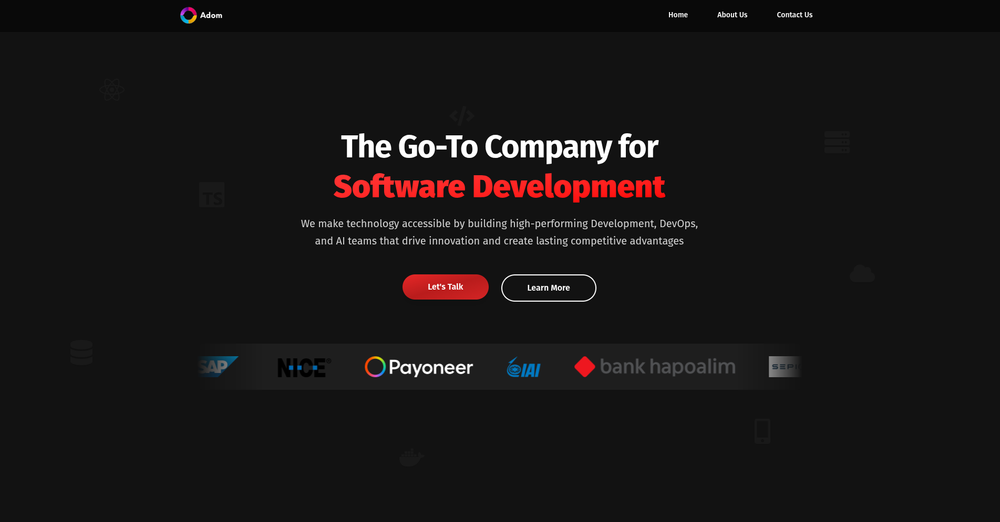

# Website Redesign Concept - Adom Tech

A demo redesign concept for the Adom Tech company website built with React, TypeScript, and Vite. This modern, responsive redesign showcases the company's software development services, team expertise, client portfolio, and provides demo contact functionality for potential clients.

Visit the [Live Demo](https://adom-tech-bbrdkykzy-netanelzeltsermans-projects.vercel.app/) to see it in action.
See the company's [Original Website](https://adom.technology/)

## Tech Stack

- React
- TypeScript
- Vite
- Tailwind CSS

## How to Run the Project

### Prerequisites
- Node.js (version 18 or higher)
- npm or yarn package manager

### Installation and Setup

1. Install dependencies:
```bash
npm install
```

2. Start the development server:
```bash
npm run dev
```

The application will be available at `http://localhost:5173`.

### Available Scripts

- `npm run dev` - Start the development server
- `npm run build` - Build the project for production
